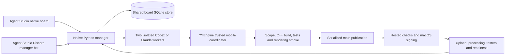

# Architecture and recovery

The engine and iOS packaging are unchanged. Deterministic gameplay stays independent of SDL.
Agent Studio's native manager owns planning conversations, tasks, provider routing, saved
sessions, questions, acceptance, progress, transcripts, usage views and the SQLite outbox.
The Discord transport uses the existing developer allowlist with guild/channel/thread checks.

The mobile adapter is loaded from the supervisor's published release. Both workers commit and
return structured evidence; they do not publish, create PRs, merge or distribute. A separate
integration lock serializes publication. The coordinator rejects committed changes outside
engine/, the selected game and tests/, including rename sources, secrets and symlinks. It
integrates in a detached scratch worktree and runs trusted build scripts against candidate
sources without passing service credentials. It revalidates after rebasing and pushes without
force; a racing main push causes another rebase/check cycle. Dirty or changed worker checkouts
are preserved. The manager retains the native worker self-review policy.

Board acceptance is bound to the landed commit and releases dependencies. Apple delivery
continues independently, including after acceptance. Each landed revision has a durable delivery
record keyed by task and exact commit. Explicit build requests persist their SHA, game and a
unique request ID before dispatch. Lost dispatch responses are recovered by that identity;
the same request is never blindly dispatched again. A request still waiting for GitHub's run
needs inspection if its dispatch was definitively rejected; a local retry creates a new request.

Delivery polls the existing workflow and selected game job. Workflow success alone does not
mean ready: Verify TestFlight readiness must succeed as well as the selected job. That step
verifies processing, internal group assignment and internal testing state. Build numbering and
already-uploaded build reconciliation stay in the existing workflow/Fastlane code. Real iPhone
installation and performance remain device acceptance work.

The board and registry live under %LOCALAPPDATA%/YYEngine. Back up the board using its backup
command, or after stopping all readers/writers. Worker checkouts live under ignored
.yy/studio-workers; scratch integrations live in local application data. The manager runs
published releases and upgrades through the native release handoff. /pause, /resume and /stop
retain Agent Studio behavior; stop interrupts local managed work while cloud jobs continue.

The local board binds to loopback and is not publicly exposed. Discord has an outbound Gateway
connection and no tunnel dependency. Retired board data is kept only as an ignored recovery
archive on the migration machine; no legacy service is part of the active application.
