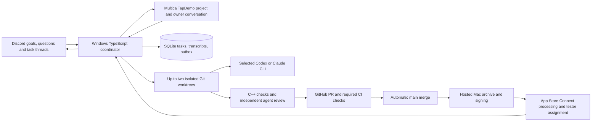

# Architecture and recovery

## Boundaries

Games implement `yy::Game` and receive renderer/audio services. A fixed 60 Hz simulation is capped at six catch-up ticks; background/minimized apps pause gameplay and audio and reset accumulated time. The renderer maps portrait game coordinates through the current window safe area to framebuffer pixels. Asset names are relative to a game-specific packaged directory; BMP textures are cached. The platform backend remains inside the engine.

The service stores request identity, task status, worktree/branch/base/head/merge SHAs, PR/workflow references, provider session IDs, and transcripts. A unique Discord event ID suppresses duplicate task/message processing. SQLite uses WAL. Outbox notifications survive restarts; receipt footers let retries reconcile a send whose response was lost, avoiding duplicate reports. The service lock rejects a second coordinator process.

Up to two local workers execute in separate worktrees. Remote reconciliation and
publication use one serial lane; each queued candidate rechecks main before merge.
Planning and quick questions have their own reader lanes, independent of worker
occupancy. Pause holds new workers while active work, planning and quick chat can
finish. Stop aborts managed local processes and preserves their sessions/worktrees;
resume requeues stop-interrupted tasks. Remote cloud jobs remain independently
reconcilable. Both authorized users can act in the shared conversations.

The optional Multica bridge uses the authenticated CLI profile, with service secrets
excluded from its subprocess environment. A local mapping restricts board command
authors to the existing Discord allowlist. Cards and status changes alone do not
enqueue work. Task markers recover ambiguous issue creation; per-notification
receipts recover ambiguous comment delivery. Separate Discord/board delivery flags
prevent one surface from consuming the other's notifications. A deleted card is
not recreated. Board outage does not stop the coordinator's existing work.

Read-only plan requests return structured proposed tasks. Owner approval creates
all implementation tasks and their earlier-task dependencies in one transaction;
the same proposal cannot create a second set. Waiting for a dependency/worker/CI
is distinct from waiting for owner input. This adopts BodySimulation manager
behavior while retaining YYEngine's single coordinator and independent review. Planning rounds share one conversation, with replies buffered during active turns. Published commits wait for owner acceptance before dependent tasks start; automatic publication itself needs no further approval. Request changes resumes the same task and retains prior delivery evidence. Claude workers/planners/quick chat resume their respective sessions; independent reviewers never inherit worker sessions. Quick chat resets after three quiet hours.

The provider contract returns structured `outcome`, `summary`, `question`, and `review`. Invalid/missing review approval cannot pass a candidate. Each review is a fresh read-only invocation. Provider subprocesses receive a restricted environment that excludes Discord, GitHub, and Apple secrets. Prompts enter through stdin; shell interpolation is not used. Codex applies its workspace/read-only sandbox; Claude uses its tool permission rules with unattended prompts denied.

Game tasks are limited to the engine, selected game, and tests, including changes already committed by the provider. The coordinator runs trusted validation scripts, commits the candidate, pushes with a lease, creates/reuses the PR, and merges only the validated head SHA after all three CI checks succeed. If main changes, it rebases and repeats checks/review. Branch protection is optional. The coordinator refreshes main immediately before merging; without an up-to-date branch rule, a separate push during the merge API request can still change the base after that refresh.

## States and recovery

Local states: `queued → preparing → implementing → checking → reviewing → awaiting_checks`. An approved candidate proceeds through `merging → building → uploaded → processing → ready`. Discussion tasks finish as `completed`. Clarification/login/tool denials use `waiting_input`; crashes during local work use `interrupted`; unrepaired failures use `failed`.

Worktrees and branches survive failure/cancellation. There are an initial attempt and at most two repairs. A resumed interrupted task checks the existing worktree. Uncommitted edits cannot be blindly rebased over a changed main; resolve that preserved checkout deliberately, then resume. Inspect task records/status and `.yy/logs/<task-id>.log` for local diagnostics. Configured secret values are redacted from stored error output and Discord messages.

After a restart, PR state is queried before merging again. Main-push builds are discovered before dispatching a fallback build. Explicit dispatch intent is persisted before calling GitHub. Remote checks/workflows remain pending during transient network failures instead of starting another implementation. Failed workflow retries rerun failed jobs in the same run and reuse the same build number; the upload lane searches App Store Connect for that exact existing build before uploading. Apple's processing/group/readiness checks must all succeed before the bot announces `ready`.

Cancellation terminates a local process tree and requests remote cancellation. A cancellation racing an in-flight merge records the completed merge and follows up to cancel its build. A GitHub workflow can only be cancelled once GitHub exposes the run; the service continues reconciliation for pending cancellation. Already merged code and uploaded TestFlight builds are not reversed. Revert a bad squash commit through a normal PR; main's delivery workflow builds the resulting revert.

Back up `.yy/tasks.sqlite` together with its WAL using a SQLite-aware backup or after stopping the service, plus any needed worktrees/logs. Never copy provider credential files into the repository. Startup reconciles authorized messages after persisted per-channel cursors, including task-thread replies sent while the PC was offline. Pre-migration history is not reinterpreted. Cloud workflow status is reconciled after startup.

## Growth points

Separate provider adapters, storage, GitHub integration, and coordination so another provider or hosted worker can replace the local runtime later. A more specialized GPU renderer, asset packing, Android packaging, and broader device benchmarks should follow measurements and actual game needs.
